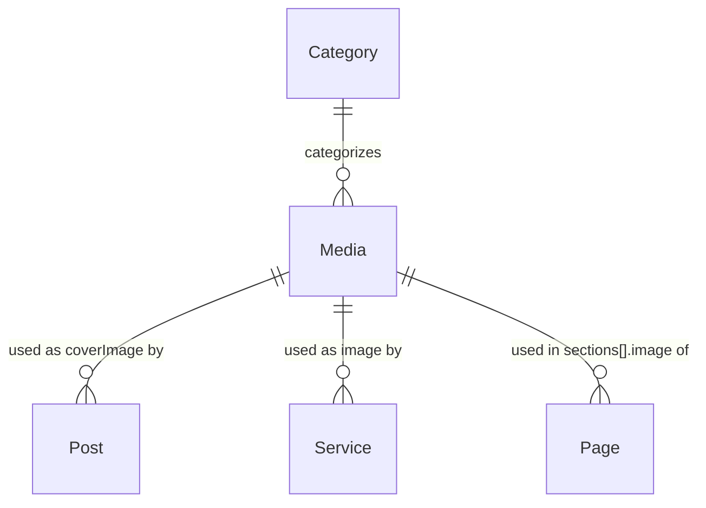

# Sweet Crumb Bakery — CMS

A MERN-style CMS (Next.js App Router + MongoDB) with a public bakery website and an admin panel for managing content, media, and customer inquiries — built for the CRE-MERN-CMS-01 assignment.

- **Public site:** home, about, menu, gallery, blog, downloads, contact
- **Admin panel:** media library, posts, services, pages, categories, submissions inbox, dashboard
- **Auth:** OAuth-only admin login (Google or GitHub), gated by an email allowlist — no public sign-up
- **Storage:** Cloudinary for all uploaded files, MongoDB Atlas for content

## Tech stack

| Layer | Choice |
|---|---|
| Framework | Next.js 16 (App Router, Turbopack) |
| Database | MongoDB Atlas via Mongoose |
| File storage | Cloudinary |
| Auth | `@kartikgangil/watchman_js` (OAuth URL/token exchange) + custom JWT session cookie |
| Rich text | TipTap |
| Styling | Tailwind CSS v4 + `@tailwindcss/typography` |

## Setup

### 1. Prerequisites

- Node.js 20+
- A MongoDB Atlas cluster (free M0 tier is enough)
- A Cloudinary account (free tier)
- A Google Cloud OAuth client, and/or a GitHub OAuth App

### 2. Install

```bash
npm install
```

### 3. Environment variables

Create `.env.local` in the project root:

```
MONGODB_URI=mongodb+srv://...                    # Atlas connection string
CLOUDINARY_CLOUD_NAME=...
CLOUDINARY_API_KEY=...
CLOUDINARY_API_SECRET=...
SESSION_SECRET=...                                # any long random string — signs the session JWT
ADMIN_EMAIL=you@example.com                       # the only email allowed to log into /admin
GOOGLE_CLIENT_ID=...
GOOGLE_CLIENT_SECRET=...
GITHUB_CLIENT_ID=...
GITHUB_CLIENT_SECRET=...
```

OAuth callback URLs to register with each provider:

- Google: `http://localhost:3000/api/auth/google/callback` (dev) and `https://bakery-cms-iota.vercel.app/api/auth/google/callback` (prod)

- GitHub: `http://localhost:3000/api/auth/github/callback` (dev) and `https://bakery-cms-iota.vercel.app/api/auth/github/callback` (prod)

### 4. Run

```bash
npm run dev      # http://localhost:3000
npm run build && npm run start   # production build
```

### 5. Log in as admin

Visit `/login` and sign in with Google or GitHub, using the email set as `ADMIN_EMAIL`. Any other account is rejected.

## Deployment

The application is deployed on Vercel.

- **Live Website:** https://bakery-cms-iota.vercel.app
- **GitHub Repository:** https://github.com/Armaanjotkaur/bakery-cms

Production OAuth callback URLs:

- Google: `https://bakery-cms-iota.vercel.app/api/auth/google/callback`
- GitHub: `https://bakery-cms-iota.vercel.app/api/auth/github/callback`

Production testing completed successfully for:

- Google OAuth login
- GitHub OAuth login
- Admin authentication and route protection
- MongoDB Atlas connection
- Cloudinary media upload and deletion
- Posts, services and pages
- Categories
- Contact form and submissions
- Downloads
- Public website pages
- Logout

## Folder structure

```
src/
├─ app/
│  ├─ (site)/                  # public website (route group — own header/footer layout)
│  │  ├─ page.js               # home
│  │  ├─ about/page.js
│  │  ├─ menu/page.js
│  │  ├─ gallery/page.js
│  │  ├─ blog/page.js
│  │  ├─ blog/[slug]/page.js
│  │  ├─ downloads/page.js
│  │  ├─ contact/page.js
│  │  └─ layout.js
│  ├─ admin/                   # admin panel (protected)
│  │  ├─ page.js               # dashboard
│  │  ├─ media/page.js
│  │  ├─ posts/, services/, pages/, categories/, submissions/
│  │  └─ layout.js             # session check + nav
│  ├─ api/
│  │  ├─ auth/{google,github}/route.js            # OAuth redirect
│  │  ├─ auth/{google,github}/callback/route.js   # OAuth callback → session
│  │  ├─ auth/logout/route.js
│  │  ├─ media/route.js, media/[id]/route.js       # upload, list, replace, delete
│  │  ├─ posts/, services/, pages/, categories/    # CRUD, each with route.js + [id]/route.js
│  │  └─ submissions/route.js, submissions/[id]/route.js
│  ├─ login/page.js
│  └─ layout.js                # root layout, fonts, global metadata
├─ components/
│  ├─ admin/                   # PostForm, ServiceForm, PageForm, MediaPicker, DeleteButton, MarkReadButton
│  └─ site/                    # SiteHeader, SiteFooter, ContactForm
├─ lib/
│  ├─ db.js                    # cached Mongoose connection + model registration
│  ├─ auth.js                  # session cookie create/read/destroy, admin email check
│  ├─ api.js                   # requireAdmin() guard for API routes
│  ├─ cloudinary.js            # Cloudinary config + upload helper
│  ├─ media.js                 # upload validation (MIME whitelist, size cap)
│  ├─ slugify.js, uniqueSlug.js
│  └─ usedIn.js                # tracks which content docs reference a Media file
├─ models/                     # Category, Media, Service, Post, Page, Submission
└─ proxy.js                    # route guard for /admin/* (Next 16's renamed middleware.js)
```

## Data model



- **Category** — `{ name, slug, type: "media" | "content" }`. Media categories organize uploads (e.g. Gallery, Brochures); content categories are available for future use.
- **Media** — the single source of truth for every uploaded file. Stores the Cloudinary `url`, `publicId`, and `resourceType` (needed to delete the right Cloudinary asset type), an MD5 `hash` for duplicate detection, an optional `category` ref, and a `usedIn` array of `{ refType, refId }` recording every Post/Service/Page that references it.
- **Post** — blog entries. `coverImage` refs Media. `status` is `draft`/`published`; `publishedAt` is set only on the transition to published.
- **Service** — menu items. `image` refs Media.
- **Page** — flexible content pages (e.g. "about"). Each entry in `sections[]` has its own optional `image` ref, so a single page can carry many images.
- **Submission** — contact form entries. No refs; `isRead` toggles from the inbox.

`.populate()` is how these refs get resolved — e.g. `Post.find().populate("coverImage")` behaves like a SQL join, pulling in the full Media doc instead of just its ObjectId.

## Key decisions

**Why Cloudinary instead of local file storage?**
Vercel's serverless filesystem is read-only (and ephemeral) at runtime — anything written to disk during a request doesn't survive past that request, let alone a redeploy. Cloudinary also gives free image transformation/CDN delivery, which local storage wouldn't.

**How are admin routes protected — isn't `proxy.js` a single point of coverage?**
Two layers, deliberately. `src/proxy.js` (Next 16 renamed `middleware.js` to `proxy.js`) does a cheap cookie-presence check on `/admin/*` for a fast redirect. The real gate is a full JWT verification (`getSession()` in `src/lib/auth.js`) called again inside `src/app/admin/layout.js` and independently inside every single admin API route via `requireAdmin()`. Next's own docs are explicit that a Server Function or Route Handler reachable outside the proxy's matcher pattern would otherwise be silently unprotected — so the proxy is a UX optimization, not the actual security boundary.

**Why is the session a hand-rolled JWT cookie instead of a library feature?**
The assignment mandates `@kartikgangil/watchman_js` for auth, but reading its actual source shows it only provides OAuth URL builders, authorization-code exchange, and bare `GenToken`/`VerifyToken` JWT helpers — no cookies, no session management, no Next.js integration, despite what a first glance at "an auth library" might suggest. `src/lib/auth.js` builds the session layer on top: `GenToken` signs a JWT into an httpOnly cookie, `VerifyToken` reads it back, and `isAdminEmail()` is the actual allowlist check performed once at OAuth-callback time.

**Why does GitHub login fetch `/user/emails` separately instead of using the email from `/user`?**
`watchman_js` requests GitHub's `user` scope, and GitHub's `/user` endpoint only returns a non-null `email` if the account has a public email set. Since `user` scope transitively includes `user:email` access, the callback route calls `GET /user/emails` and picks the primary verified address, so login works for accounts with a private email too. Google's OAuth flow doesn't have this problem — it always returns `email` directly.

**Why cache the Mongoose connection in `lib/db.js`?**
Each serverless function invocation can cold-start; without caching the connection on `global`, every request would open a fresh connection to Atlas, quickly exhausting the connection pool.

**Why does `lib/db.js` import every model file as a side effect?**
Mongoose only resolves a `ref` (e.g. `coverImage: { ref: "Media" }`) if that model has been registered somewhere in the current process — and a page that queries `Post` but never imports `Media` won't have registered it, so `.populate("coverImage")` throws `MissingSchemaError`. Whichever route happens to run first in a fresh process determines which models are "warm," which made this bug appear intermittently depending on load order. Importing every model inside `dbConnect()` — which every route already calls before querying — makes registration unconditional instead of a matter of luck.

**What happens on delete or replace of a file that's in use?**
`Media.usedIn` records every `{ refType, refId }` that references a file. Delete calls `cloudinary.uploader.destroy(publicId, { resource_type })` (using the stored `resourceType`, since Cloudinary files uploaded via `resource_type: "auto"` land in different buckets — images/PDFs under `"image"`, Word docs under `"raw"` — and destroying with the wrong one silently fails). Replace uploads the new file, updates the same Mongo `_id` in place so every reference stays valid, and only then destroys the old Cloudinary asset. Whenever a Post/Service/Page's image reference changes, `lib/usedIn.js` diffs the old and new reference sets to keep `usedIn` accurate.

**Why are the public content pages (`/`, `/about`, `/menu`, `/gallery`, `/downloads`, `/blog`, `/blog/[slug]`) all forced dynamic?**
Next statically prerenders any page it can at build time — and since these pages read straight from MongoDB, `next build` would have baked in whatever the database looked like *during the build*, not what an admin publishes afterward. Each of these pages sets `export const dynamic = "force-dynamic"` so they render fresh on every request instead.

## Assumptions

- Single admin identity, set via `ADMIN_EMAIL` — no multi-user roles or permissions.
- Rich text HTML from TipTap is rendered with `dangerouslySetInnerHTML` without sanitization, since it's authored only by the allowlisted admin, not public input. A real multi-author deployment would sanitize it (e.g. with DOMPurify) before render.
- The Gallery and Downloads pages look for categories with the exact slugs `gallery`, `brochures`, and `reports` — an admin has to create categories with those names for those pages to populate.
- Max upload size is 5 MB, enforced server-side; the accepted types are JPEG/PNG/WEBP images, PDF, and Word docs (`.doc`/`.docx`).
- Duplicate uploads are detected by MD5 hash of the file content, not filename.
